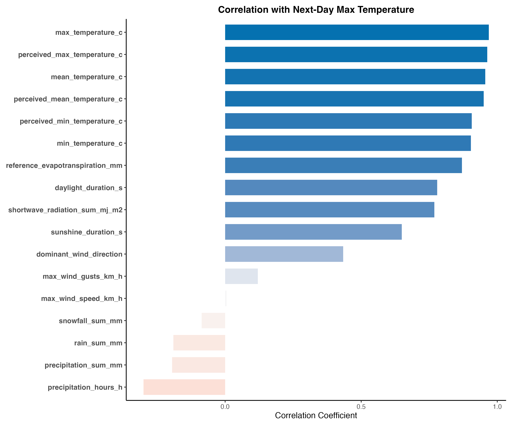
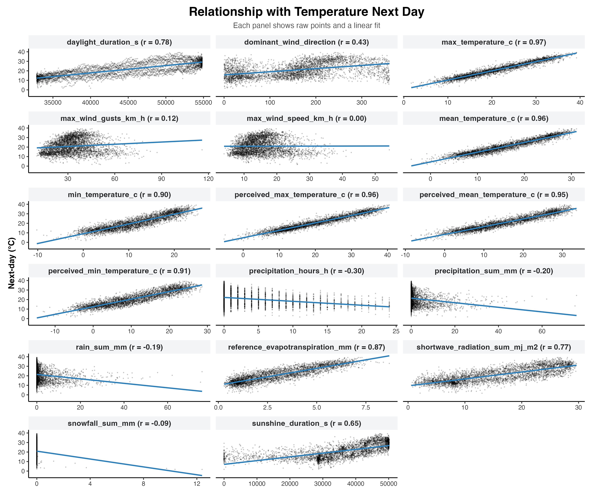
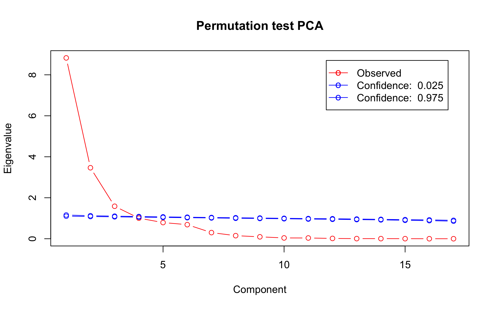
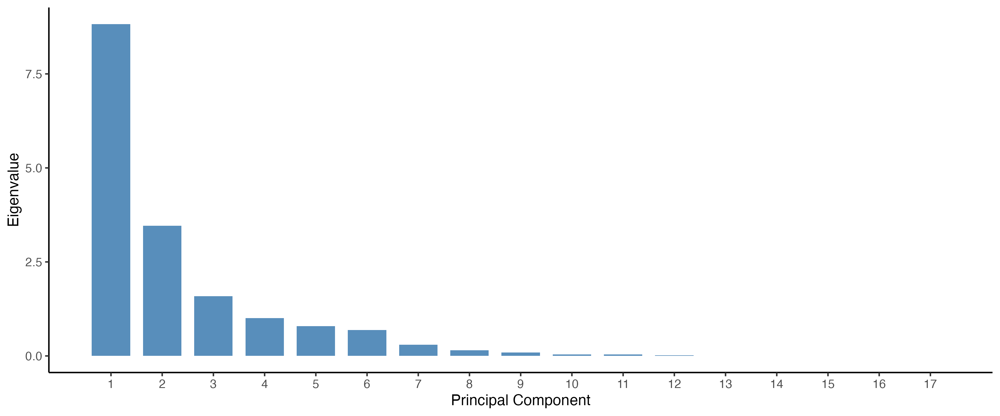
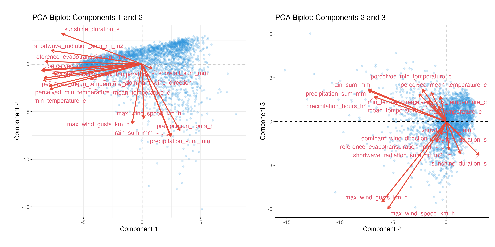
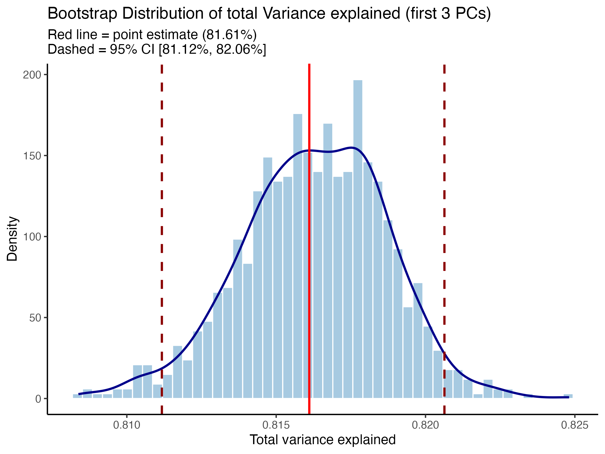
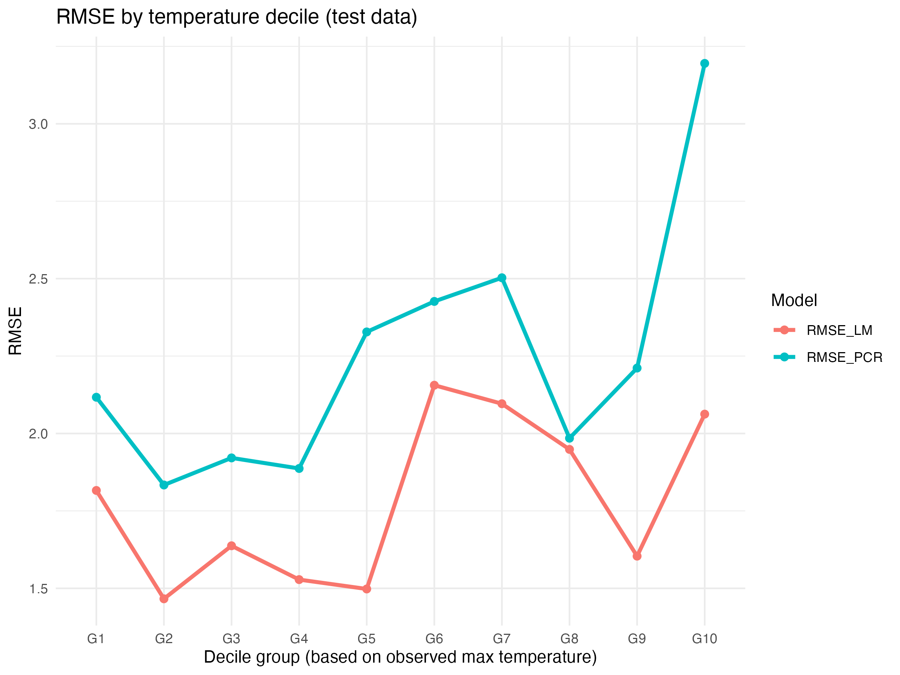

```{r include=FALSE}
# install pacman if you don’t have it yet
if (!require("pacman")) install.packages("pacman")
# load all packages at once
pacman::p_load(
  tidyverse, ggplot2, dplyr, readr, janitor, stringr, knitr, scales, kableExtra, factoextra, patchwork, pls)

# no scientific notations
options(scipen = 999)
rm(list = ls())

# Directory setup
path = dirname(rstudioapi::getSourceEditorContext()$path) # Path is directory of this file
setwd(path)     # Set working directory
data <- read.csv("a2_data_group_9.csv")

# Preprocessing
data <- janitor::clean_names(data) # cleans all the cols names automatically 
data <- data %>% select(-location_id)

```

# Introduction
Short horizon temperature forecasts inform planning in energy, transport, public health, and city services, where load balancing, maintenance, and emergency response depend on credible next-day expectations. Utilities, grid operators, and municipalities translate such forecasts into operational budgets, staffing, and risk management strategies. Scientifically, multiple drivers shape daily maximum temperature- surface energy balance (radiative fluxes, cloud cover, albedo), boundary-layer dynamics (humidity, wind speed, mixing), seasonal cycles, and urban heat-island effects- the joint behavior of which exhibits collinearity and regime dependence. Hence, the need to identify useful predictors for next-day maxima and compress them without sacrificing accuracy, leading to the central research question of this study: *To what extent does PCA-based feature extraction improve next-day maximum-temperature prediction when evaluated out-of-sample and across different target regimes?* The results of this analysis aim to clarify which compressed structures carry predictive signal, informs adoptable model choices for short-horizon operations, and indicates where forecasts degrade across regimes.

# Data 
Daily weather observations from the Copernicus Regional Reanalysis for Europe (CERRA) are used for Rome, yielding 4,020 days (~12 years). The dependent variable is next day daily maximum temperature in °C. The independent variables include all numeric meteorological variables observed on day *t*; including the circular angle `dominant_wind_direction` (0–360°) as is and the same-day `max_temperature_c` as a lagged regressor for forecasting day *t+1*. Initial summary statistics show that temperature levels center around mean 20.90 °C, with average perceived measures averaged at 15.43 °C and average perceived max temperatures at 20.52 °C. Wind intensity is moderate on average at 15.26 km/h. Average radiative and evapotranspiration processes show clear seasonality (15.69 MJ/m², 3.03 mm), with photoperiod measures confirming winter–summer contrast- where the average daylight duration is ≈ 12.21 h. Hydrometeorological activity averages are low but episodic. Average precipitation lands at 2.44 mm, where the average rainfall lands at 2.43mm, consistent with many dry days punctuated by occasional events.

# Methodology

Some common notation in the following methodolgy are as follows. \(y_{t}\) denotes the daily maximum temperature (°C) on day \(t\) and \(X_{t}\in\mathbb{R}^{p}\) is the vector of meteorological predictors observed on day \(t\). The one day ahead forecasting is done through supervised regression using aligned pairs \(\{(X_{t},\,y_{t+1})\}_{t=1}^{T-1}\) in which the response variable is \(y_{t+1}=\texttt{max\_temperature\_c}\) on the next day, and the predictors are the full numeric feature set on day \(t\) including the same-day `max_temperature_c` as a lagged regressor and the circular angle `dominant_wind_direction` (0–360°) included untransformed.

The baseline linear model which also serves as the benchmark in this analysis is an Ordinary Least Squares (OLS) model
\[
y_{t+1}=\beta_0+\sum_{j=1}^{p}\beta_j X_{t,j}+\varepsilon_{t+1},
\]
While OLS provides interpretable results, it is sensitive to multi-collinearity among meteorological variables (e.g., temperature levels and perceived temperatures, radiation and evapotranspiration). The OLS model is trained on the training set and evaluated on the test set, the demarcation of which is later specified. \(R^2\) and RMSE is are used for comparison.
  
A Principal Component Analysis (PCA) is applied on the training predictors, after centering means and scaling variances. PCA focuses primarily on de-correlation and dimensional reduction under strong multi-collinearity, as mentioned above. While it is not tailored to extremes, it provides an independent basis for stable regression and clear diagnostics. With training matrix \(X_{\text{train}}\in\mathbb{R}^{n\times p}\), PCA computes the decomposition \(X_{\text{train}}=U D V^{\top}\). Columns of \(V\) are the loadings and the principal component scores are \(Z=X_{\text{train}}V\). The variance explained by the \(k\) leading components is \(\text{VAF}_k=\sum_{j=1}^k d_j^2 / \sum_{j=1}^p d_j^2\). In this study, the diagnostic checks include the scree plot, a cumulative Variance Acounted For (VAF) curve, biplots for (PC1, PC2) & (PC2, PC3), and loading tables to interpret variable groupings.

In order to choose the number of components, three main methods are applied on the training set- a cumulative VAF threshold at \(\ge 85\%\)), The Kaiser’s rule where eigenvalues \(>1\), and a parallel (permutation) analysis comparing real eigenvalues to those from column wise permuted data. The main model also conducts sensitivity checks at \(k-1\) and \(k+1\), to assess robustness of predictive results to the retention level.

Sampling variability in \(\text{VAF}_k\) is quantified by nonparametric bootstrapping, where rows of \(X_{\text{train}}\) are resampled \(B=1000\) times. PCA is then recomputed on each bootstrap sample, and \(\text{VAF}_k\) is aggregated to form a sampling distribution. A 95% percentile confidence interval is reported. This procedure is performed on training data to avoid test leakage.

The principal component analysis regresses the response on the first \(k\) PC scores:
\[
y_{t+1}=\alpha_0+\sum_{j=1}^{k}\gamma_j Z_{t,j}+\eta_{t+1},\qquad Z_{t}=X_{t}V_{(:,1:k)}.
\]
The rotation \(V\) and training centering/scaling parameters are frozen and applied to \(X_{\text{test}}\) to obtain test scores before prediction.

For this analysis, a contiguous 80/20 split is performed. The first 80% of aligned pairs form the training set and the final 20% form the test set used only once for final evaluation. All data-dependent transformations such as scaling and PCA rotations are estimated on the training set and then applied to the test set.

Prior to modeling, linear associations between each predictor in \(X_t\) and the target \(y_{t+1}\) are examined using Pearson correlations and scatter plots with OLS trend lines. These diagnostics motivate the use of PCA and provide context for interpreting early component loading.

The model's predictive accuracy is assessed on the test set using Root Mean Squared Error (RMSE) as the primary metric and the \(R^2\) is provided for context. To examine regime dependence, test observations are partitioned into deciles of the observed \(y_{t+1}\), and the RMSE by each decile is reported for the OLS and PCA model specifications, indicating whether errors concentrate in colder or hotter ranges. Random seeds are set for reproducibility of re-sampling and permutation steps.

# Results 

Table A1 (Appendix A) shows the correlation coefficients of the predictor variables and our dependent variable. We can see that next-day maximum temperature is strongly correlated to same-day thermal conditions: higher current max/mean/min (and their perceived counterparts) go hand-in-hand with hotter tomorrows. Seasonal and surface-energy indicators (sunshine, daylight, shortwave radiation, and reference evapotranspiration) move in the same direction, pointing to a “clear, dry, sunny” pattern that precedes warmer days. In contrast, precipitation works in the opposite way, meaning that more hours or larger sums of rain/snow today are followed by lower next-day temperatures. Wind variables don't show any strong effects. Figure A1 presents a bar plot visually summarizing the correlation coefficients from Table A1. The scatterplots in Figure A2 further confirm these results showing positive, near-linear trends for temperature and radiation related variables, and downward slopes for precipitation.

To avoid look-ahead bias, we estimated Principal Components Analysis only on the training dataset and froze its rotation and scaling. The scree plot in Figure A4 shows a sharp elbow with eigenvalues for PC1-PC4 of 8.82, 3.46, 1.59, 1.00, respectively (Table A2). By the third component we already explain about 82% of the variance, with only a small gain if a fourth is added (up to 88%), as shown in Table A3. The two selection rules point in slightly different directions: the Kaiser criterion would keep 4 components, whereas the parallel analysis based on the permutation test (Figure A3) is more conservative with k = 3. The difference arises because the Kaiser criterion and parallel analysis rely on different principles. The Kaiser rule retains all components with eigenvalues greater than one, which can sometimes overestimate the true dimensionality by capturing small but non-random variance. In contrast, parallel analysis compares the observed eigenvalues to those from randomly generated data and keeps only components that clearly exceed random noise levels. As a result, it is typically more conservative, leading to fewer retained components. Balancing parsimony and coverage, we adopt 3 components as the baseline for prediction and treat the fourth as an optional robustness check.

Table A4 shows the PCA reduction of weather variables into three interpretable dimensions, and the biplots of their relationships can be found in Figure A5. The first component acts like a "seasonality/heat" axis: it loads in the same direction on actual and perceived temperatures, sunshine, shortwave radiation, daylight, and evapotranspiration, with the opposite sign on precipitation, effectively contrasting warm, sunny, dry days with cool, wet, overcast ones. The second component reflects precipitation intensity with gustiness, distinguishing short, heavy rainfall episodes that coincide with stronger gusts from longer, lighter precipitation under calmer winds. The third captures wind strength versus warmth, separating windy–cool from calm–warm conditions and being driven primarily by wind speed and gusts with lighter temperature contributions. Communalities indicate that the best-represented variables in the k = 3 subspace are actual and perceived temperatures (max_temperature_c, mean_temperature_c, perceived_max_temperature_c, perceived_mean_temperature_c), together with radiative and photoperiod indicators (shortwave_radiation_sum_mj_m2, daylight_duration_s, sunshine_duration_s) and reference_evapotranspiration_mm. Snowfall, precipitation hours, and dominant_wind_direction are least represented. Although the patterns in PC1–PC3 are generally interpretable, their interpretation is not straightforward. PCA is an unsupervised method that maximizes overall variance rather than predictive relevance. As a result, variables that are physically unrelated may load together due to seasonal collinearity, and loadings with opposite signs can reflect co-occurring weather regimes rather than clear causal relationships. We retain three components because the scree flattens after the third, the parallel-analysis cutoff aligns with a conservative choice of three, and cross-validated PCR error improves up to k = 3 with small gains after. In addition, the first three components together account for about 82% of the variance (bootstrap 95% CI = 81.1–82.1%), so the dimensionality reduction is reliable and not driven by a particular sample split (see Figure A6 for the bootstrap distribution).

Table A5 presents the results of our Principal Component Regression (PCR) and the benchmark Ordinary Least Squares (OLS) model on the training and test sets. Cross-validated RMSEP values, shown in Table A6, drop from 2.304 to 2.243 and finally to 2.052 when moving from one to three components, changing only marginally at four components (2.053), which indicates diminishing returns beyond k = 3. As a benchmark, we fit a standard multiple linear regression (OLS) to the original predictors. On the held-out test data, OLS achieves a lower RMSE (1.80) than PCR with k = 3 (2.156). PCR’s $R^2$ value is high on both train and test datasets, but the absolute error is slightly larger than OLS in this split. This suggests that, for this horizon and feature set, compressing predictors with unsupervised PCA does not by itself improve point prediction accuracy over a well-specified linear model. This is consistent with expectations given (1) the near-linear relations between thermal and radiative predictors and next-day maxima and (2) inclusion of same-day max_temperature_c as a strong lagged signal that supervised OLS can exploit directly, whereas unsupervised PCA is not optimized for the target. 

To test whether predictive performance depends critically on the dimensionality retained, two additional PCR models were trained using one fewer (k = 2) and one more (k = 4) component than the baseline. As shown in Table A7, the test RMSE improves markedly from k = 2 (2.27) to k = 3 (2.16) but changes negligibly for k = 4 (2.15). The same pattern appears for R², which increases up to k = 3 and then shows no further improvement. These results confirm that the PCR model’s performance is stable around the chosen dimensionality and that retaining three components provides an effective balance between accuracy and parsimony. Because PCA optimizes total variance, not tail loss, it can under-weight rare extremes even if those are operationally important. That limitation motivates our final check: grouping test observations into deciles by realized next-day heat and plotting RMSE by method. The resulting RMSE values for each decile are summarized in Table A8 and visualized in Figure A7. The resulting curves are broadly similar across deciles (error does not spike dramatically in specific bins for this split), with OLS generally at or below PCR. Error profiles are not strongly dependent on the heat level in this split; if tail fidelity becomes a priority, one could consider quantile or weighted regression, EVT-informed losses, or nonlinear terms (e.g., splines for radiation or seasonality).

# Conclusion and Discussion

PCA successfully compressed the weather feature space into three interpretable dimensions that together explain ~82% of training variance. The retained components capture a warm–sunny–dry vs cool–overcast–wet gradient (PC1), a precipitation–gustiness axis (PC2), and wind strength vs warmth (PC3). However, when evaluated out-of-sample on a contiguous 20% test set, the OLS model outperforms the PCA, with an RSME (≈1.80) lower than PCR (≈2.16). Sensitivity checks showed diminishing returns beyond 3 principal components, aligning with the scree/parallel-analysis decision rule. Answering the central research question, the study finds that PCA-based feature extraction does not improve next day maximum temperature prediction over a well-specified linear regression, for this specific horizon, city (Rome), and split. However, PCA remains valuable for diagnostics, de-correlation, and compact reporting, but not as a stand-alone route to lower point-forecast error here.

Two design choices likely shaped this outcome and point to refinements. First, PCA is unsupervised and it maximizes total variance rather than temperature predictive variance. Supervised alternatives like OLS may better exploit signal under collinearity. Under collinearity, ridge/elastic-net would also be expected to match or exceed PCR by targeting predictive variance directly while keeping all (ridge) or grouped (elastic-net) signals. Second, two features merit targeted treatment: the inclusion of same-day `max_temperature_c` as a lagged regressor- useful but potentially dominating simpler components- and circular wind direction, which was included untransformed. Encoding direction via \(\sin/\cos\) terms can make wind-related structure legible to linear methods. For robustness, future work should use rolling-origin evaluation (rather than a single 80/20 split), probe nonlinearities/interactions (e.g., splines for radiation/seasonality), and re-test decile performance with an emphasis on extremes.


```{r include=FALSE}
# Prepare data
df_corr <- data %>% dplyr::select(where(is.numeric))
X_corr  <- df_corr[-nrow(df_corr), ]
y_corr  <- df_corr$max_temperature_c[-1]

# Correlations
correlations <- sapply(X_corr, function(x) cor(x, y_corr, use = "complete.obs"))
correlations <- sort(correlations, decreasing = TRUE)

# Data frame
cor_df <- data.frame(
  Variable = names(correlations),
  Correlation = round(as.numeric(correlations), 3)
)

cor_table <- cor_df %>%
  kable(
    col.names = c("Predictor Variable", "Correlation Coefficient"),
    booktabs  = TRUE,
    align     = c("l", "r"),
    linesep   = ""
  ) %>%
  # add a title row that is NOT numbered (so no “Table 1:”)
  add_header_above(c("Correlation with Next-Day Max Temperature" = 2),
                   bold = TRUE, align = "c") %>%
  kable_styling(
    latex_options = c("hold_position", "striped"),
    full_width    = FALSE,
    font_size     = 10
  ) %>%
  column_spec(1, width = "8cm") %>%
  column_spec(2, width = "4cm")

```


```{r include=FALSE}
# --- Clean, minimalist plot ---
p <- ggplot(cor_df, aes(x = reorder(Variable, Correlation), y = Correlation, fill = Correlation)) +
  geom_col(width = 0.7, show.legend = FALSE) +
  coord_flip() +
  scale_fill_gradient2(
    low = "#fcae91", mid = "#f7f7f7", high = "#0571b0", midpoint = 0
  ) +
  labs(
    title = "Correlation with Next-Day Max Temperature",
    x = NULL,
    y = "Correlation Coefficient"
  ) +
  theme_classic(base_size = 14) +
  theme(
    plot.title = element_text(face = "bold", hjust = 0.5, size = 16),
    axis.text.y = element_text(size = 12, face = "bold"),
    axis.text.x = element_text(size = 11),
    panel.grid.major.y = element_blank(),
    panel.grid.minor = element_blank(),
    plot.margin = margin(10, 10, 10, 10)
  )

# Save the filtered plot
ggsave("correlation_bar.png", plot = p, width = 12, height = 10, dpi = 300)
```


```{r include=FALSE}
# 2) Long data for faceting
plot_df <- X_corr %>%
  mutate(`Next-day (°C)` = y_corr) %>%
  pivot_longer(
    cols = -`Next-day (°C)`,
    names_to = "variable",
    values_to = "x"
  ) %>%
  drop_na(x, `Next-day (°C)`)


# 3) Pretty facet labels with r values
lab_map <- setNames(
  paste0(names(correlations), " (r = ", sprintf("%.2f", correlations), ")"),
  names(correlations)
)

# 4) Plot
p <- ggplot(plot_df, aes(x = x, y = `Next-day (°C)`)) +
  geom_point(alpha = 0.25, size = 0.8, stroke = 0) +
  geom_smooth(method = "lm", formula = y ~ x, se = FALSE,
              linewidth = 0.9, color = "#2C7FB8") +
  facet_wrap(~ variable,
             labeller = as_labeller(lab_map),
             scales = "free_x",
             nrow = 6) +
  labs(
    title    = "Relationship with Temperature Next Day",
    subtitle = "Each panel shows raw points and a linear fit",
    x = NULL, y = "Next-day (°C)"
  ) +
  theme_classic(base_size = 12) +
  theme(
    plot.title         = element_text(hjust = 0.5, size = 18, face = "bold",
                                      margin = margin(b = 6)),
    plot.subtitle      = element_text(hjust = 0.5, size = 11, color = "grey30",
                                      margin = margin(b = 8)),
    axis.text          = element_text(size = 9, color = "grey20"),
    axis.title.y       = element_text(size = 12, face = "bold"),
    panel.grid.minor   = element_blank(),
    panel.grid.major.x = element_blank(),
    panel.spacing      = unit(8, "pt"),
    strip.text         = element_text(size = 11, face = "bold", color = "grey15"),
    strip.background   = element_rect(fill = "#F3F4F6", color = NA),
    plot.margin        = margin(10, 12, 10, 12)
  )

# 5) Save (note: plot = p, and set white background for PNGs)
ggsave("ind_dep_relationship.png", plot = p, width = 12, height = 10, dpi = 300, bg = "white")
```


```{r include=FALSE}
# --- 3. Train Test Split (Time Series) ---

# 0) Ensure time order
data <- data %>% arrange(date)

# 1) Keep only numeric predictors (this automatically drops Date)
X_df <- data %>% select(where(is.numeric))  # includes max_temperature_c

# 2) Build aligned X (t) and y (t+1)
X <- as.matrix(X_df[-nrow(X_df), , drop = FALSE])
y <- data$max_temperature_c[-1]

# 3) Time indices (keep separately; do NOT include in X)
time_X <- data$date[-nrow(data)]
time_y <- data$date[-1]

# --- train/test split by proportion, no leakage ---
n <- nrow(X); k <- floor(0.8 * n)
X_train <- X[1:k, , drop = FALSE]; y_train <- y[1:k]
X_test  <- X[(k+1):n, , drop = FALSE]; y_test <- y[(k+1):n]
```

```{r include=FALSE}
# --- 4. Generate PC on X_train ---

# 1. Perform PCA *only* on training data
pca_model <- prcomp(X_train, center = TRUE, scale. = TRUE)

# 2. Check how much variance each component explains
summary(pca_model)

# 3. Look at the contribution of each variable to each PC
round(pca_model$rotation,2) 
```

```{r include=FALSE}
# 2. Eigenvalues (variances of PCs) and explained variance
eig  <- pca_model$sdev^2

# Show only eigenvalues > 1 (Kaiser's rule)
eig_df <- data.frame(
  PC = paste0("PC", seq_along(eig)),
  Eigenvalue = round(eig, 3)
)

# Combine PC9–PC17 into one summary row
if (length(eig) > 8) {
  rest_sum <- sum(eig[9:length(eig)], na.rm = TRUE)
  eig_df <- bind_rows(
    eig_df[1:8, ],
    data.frame(
      PC = paste0("PC9–PC", length(eig)),
      Eigenvalue = round(rest_sum, 3)
    )
  )
}

eig_table <- eig_df %>%
  kable(
    booktabs  = TRUE,
    align     = c("l", "r"),
    linesep   = ""
  ) %>%
  add_header_above(
    c("**Eigenvalues of Principal Components**" = 2),
    bold  = TRUE,
    align = "c"
  ) %>%
  kable_styling(
    latex_options = c("hold_position", "striped", "scale_down"),
    full_width    = FALSE,
    font_size     = 10
  ) %>%
  column_spec(1, width = "5cm") %>%
  column_spec(2, width = "4cm")
```

```{r include=FALSE}
# 3. Using Cumulative VAF
prop_var <- eig / sum(eig)
cum_var  <- cumsum(prop_var)

# Data frame for table
var_df <- data.frame(
  PC = paste0("PC", seq_along(prop_var)),
  `Proportion of Variance` = round(prop_var, 3),
  `Cumulative Variance` = round(cum_var, 3)
)

# Combine PC9–PC17 into one summary row
if (length(prop_var) > 8) {
  remainder <- 1 - cum_var[8]
  var_df <- rbind(
    var_df[1:8, ],
    data.frame(
      PC = "PC9–PC17",
      `Proportion of Variance` = paste0("≈ ", sprintf("%.3f", remainder), " (total)"),
      `Cumulative Variance` = "1.000"
    )
  )
}

# Create styled table
var_table <- var_df %>%
  kable(
    booktabs = TRUE,
    align = c("l", "r", "r"),
    escape = FALSE,  # needed for ≈ symbol
    linesep = ""
  ) %>%
  add_header_above(
    c("Variance Explained by Principal Components" = 3),
    bold = TRUE,
    align = "c"
  ) %>%
  kable_styling(
    latex_options = c("hold_position", "striped", "scale_down"),
    full_width = FALSE,
    font_size = 10
  ) %>%
  column_spec(1, width = "4cm") %>%
  column_spec(2, width = "5cm") %>%
  column_spec(3, width = "5cm")

```

```{r include=FALSE}
scree_df <- tibble(
  PC        = seq_along(eig),
  Eigenvalue= eig,
  Prop      = prop_var,
  CumProp   = cum_var
)

# Eigenvalues
p1 <- ggplot(scree_df, aes(x = PC, y = Eigenvalue)) +
  geom_col(fill = "steelblue", width = 0.75, alpha = 0.9) +
  labs(
    x = "Principal Component",
    y = "Eigenvalue"
  ) +
  scale_x_continuous(breaks = scree_df$PC) +
  theme_classic(base_size = 13) +
  theme(
    plot.title = element_text(hjust = 0.5, face = "bold", size = 15),
    panel.grid.minor = element_blank()
  )

# Save
ggsave("scree_plot.png", plot = p1, width = 12, height = 5, dpi = 300, bg = "white")
```

```{r include=FALSE}
# 4
permtestPCA <- function (X, nTests = 100, alpha = 0.05, center.data = TRUE, scale.data = TRUE, ...){
  # Perform a PCA permutation test
  n <- nrow(X)
  m <- ncol(X)
  X <- scale(X, center = center.data, scale = scale.data)
  if (scale.data) {a <- 1/(n - 1)} else {a <- 1}
  
  res.X      <- prcomp(X)
  eigs.X     <- res.X$sdev^2 
  eigs.Xperm <- matrix(0, m, nTests)
  Xperm      <- matrix(0, n, m)
  Xperm[, 1] <- X[, 1];
  for (i in 1:nTests){
    for (j in 2:m) {
      ind <- sort(runif(n), index.return = TRUE)$ix   # Find random permutation of values 1:n
      Xperm[, j] <- X[ind, j]
    }
    res.Xperm  <- prcomp(Xperm)
    eigs.Xperm[, i] <- res.Xperm$sdev^2 
  }
  
  perc.alpha <- matrix(0, m, 2)
  for (s in 1:m){
    perc.alpha[s,] <- quantile(eigs.Xperm[s,], c(alpha/2, 1 - alpha/2) )
  }
  plot(1:m, eigs.X, type = "b", col = "red", main = "Permutation test PCA", xlab = "Component", ylab = "Eigenvalue", ...)
  lines(1:m, perc.alpha[, 1], type = "b", col="blue")
  lines(1:m, perc.alpha[, 2], type = "b", col="blue")
  
  #String1 <- sprintf('%4.1f%% Confidence',Alpha/2)
  #String2 <- sprintf('%4.1f%% Confidence',100-Alpha/2)
  #legend('Data',String1,String2)
  string1 <- paste("Confidence: ",formatC(alpha/2, digits=3, width=5, format="f"))
  string2 <- paste("Confidence: ",formatC(1-alpha/2, digits=3, width=5, format="f"))
  
  legend("topright", inset=.05, c("Observed", string1, string2), 
         lty = c(1, 1, 1), col = c("red", "blue", "blue"), pch = c("o", "o", "o"))
  return(perc.alpha)
}

png("perm_parallel_analysis.png", width = 2400, height = 1500, res = 300)
perm_range <- permtestPCA(X_train)
dev.off()


```


```{r include=FALSE}
# Enhanced PCA Biplot with improved visual styling

set.seed(1)
plot_idx <- seq_len(min(4000, nrow(X_train)))
pca_plot <- prcomp(X_train[plot_idx, ], center = TRUE, scale. = TRUE)

# PC1 vs PC2
p12 <- fviz_pca_biplot( pca_plot, axes = c(1, 2), label = "var", # only label variables 
                        repel = TRUE, # avoid overlap with ggrepel 
                        col.var = "#E74C3C", # red loadings 
                        arrowsize = 0.8, 
                        col.ind = "#3498DB", # blue points 
                        alpha.ind = 0.2, # increased transparency for points 
                        pointsize = 1.2, 
                        
                        # Enhanced text styling 
                        labelsize = 3.5 ) + 
  # Better labels 
  labs( title = "PCA Biplot: Components 1 and 2", x = "Component 1", y = "Component 2" ) + 
  # Add subtle border 
  theme(plot.margin = margin(20, 20, 20, 20))

# PC2 vs PC3
p23 <- fviz_pca_biplot( pca_plot, axes = c(2, 3), label = "var", # only label variables 
                        repel = TRUE, # avoid overlap with ggrepel 
                        col.var = "#E74C3C", # red loadings 
                        arrowsize = 0.8, col.ind = "#3498DB", # blue points 
                        alpha.ind = 0.2, # increased transparency for points 
                        pointsize = 1.2, 
                        
                        # Enhanced text styling 
                        labelsize = 3.5, ) + 
  # Better labels 
  labs( title = "PCA Biplot: Components 2 and 3", x = "Component 2", y = "Component 3" ) + 
  # Add subtle border 
  theme(plot.margin = margin(20, 20, 20, 20),
        plot.title = element_text(hjust = 0.5, size = 18, face = "bold",
                                      margin = margin(b = 6))) +
  theme_classic()

# Combine side-by-side (patchwork)
p <- p12 + p23 + plot_layout(ncol = 2)

# Save — include extension!
ggsave("biplots_side_by_side.png", plot = p, width = 12, height = 6, dpi = 300, bg = "white")
```

```{r include=FALSE}

# Extract and round loadings
loadings <- round(pca_model$rotation[, 1:4], 2)

# Convert to data frame (keep rownames as Variable)
loadings_df <- data.frame(
  Variable = rownames(loadings),
  loadings,
  row.names = NULL
)

# Create styled kable table without "Table X:" caption
loadings_table <- loadings_df %>%
  kable(
    booktabs = TRUE,
    align = c("l", "r", "r", "r", "r"),
    linesep = ""
  ) %>%
  add_header_above(
    c("PCA Loadings for the First Four Principal Components" = 5),
    bold = TRUE,
    align = "c"
  ) %>%
  kable_styling(
    latex_options = c("hold_position", "striped"),
    full_width = FALSE,
    font_size = 11
  ) %>%
  column_spec(1, width = "5cm", bold = TRUE) %>%
  column_spec(2:5, width = "2cm")
```


```{r include=FALSE}
# --- 8. Bootstrap Confidence Interval for choosen number of PCs ---

set.seed(42)

# Assumes you already have X_train (numeric matrix/data.frame of predictors only)
k <- 3

# Fit PCA once on the original training set (useful for reporting point estimate)
pca_train <- prcomp(X_train, center = TRUE, scale. = TRUE)
eig_train <- pca_train$sdev^2
vaf_k_hat <- sum(eig_train[1:k]) / sum(eig_train)   # point estimate

# Bootstrap (simple percentile CI)
B <- 1000
vaf_boot <- replicate(B, {
  idx <- sample.int(nrow(X_train), size = nrow(X_train), replace = TRUE)
  Xb  <- X_train[idx, , drop = FALSE]
  pca_b <- prcomp(Xb, center = TRUE, scale. = TRUE)
  eig_b <- pca_b$sdev^2
  sum(eig_b[1:k]) / sum(eig_b)
})

ci <- quantile(vaf_boot, c(0.025, 0.975))
list(
  point_estimate = vaf_k_hat,
  ci_95 = ci,
  mean_boot = mean(vaf_boot),
  sd_boot = sd(vaf_boot)
)

# Convert to data frame for ggplot
df_boot <- data.frame(vaf = vaf_boot)

# Plot density + CI + point estimate
p_boot <- ggplot(df_boot, aes(x = vaf)) +
  geom_histogram(aes(y = ..density..),
                 bins = 50, fill = "skyblue3", color = "white", alpha = 0.6) +
  geom_density(color = "darkblue", linewidth = 1) +
  geom_vline(xintercept = vaf_k_hat, color = "red", linetype = "solid", linewidth = 1) +
  geom_vline(xintercept = ci[1], color = "darkred", linetype = "dashed", linewidth = 1) +
  geom_vline(xintercept = ci[2], color = "darkred", linetype = "dashed", linewidth = 1) +
  labs(
    title = "Bootstrap Distribution of total Variance explained (first 3 PCs)",
    x = "Total variance explained",
    y = "Density",
    subtitle = sprintf("Red line = point estimate (%.2f%%)\nDashed = 95%% CI [%.2f%%, %.2f%%]",
                       100*vaf_k_hat, 100*ci[1], 100*ci[2])
  ) +
  theme(plot.title         = element_text(hjust = 0.5, size = 18, face = "bold",
                                      margin = margin(b = 6)))+
  theme_classic(base_size = 13)

# Save the plot
ggsave("bootstrap_variance_distribution.png", plot = p_boot,
       width = 8, height = 6, dpi = 300, bg = "white")
```

```{r include=FALSE}
set.seed(42)

k <- k

# Fit PCR with chosen number of components
pcr_fit <- pcr(
  y_train ~ .,
  data = data.frame(y_train = y_train, X_train),
  scale = TRUE,
  center = TRUE,
  validation = "CV",
  ncomp = k   # <-- specify number of components to use
)

# PCR predictions (specify number of components = 3)
pcr_pred_test <- predict(pcr_fit, newdata = data.frame(X_test), ncomp = 3)

# Fit a standard multiple linear regression (no dimensionality reduction)
lm_fit <- lm(y_train ~ ., data = data.frame(y_train = y_train, X_train))

# Train predictions
lm_pred_train <- predict(lm_fit, newdata = data.frame(X_train))

# MLR predictions
lm_pred_test <- predict(lm_fit, newdata = data.frame(X_test))

# Train R²
ss_res_train_lm <- sum((y_train - lm_pred_train)^2)
ss_tot_train_lm <- sum((y_train - mean(y_train))^2)
lm_r2_train <- 1 - (ss_res_train_lm / ss_tot_train_lm)

# Test R²
ss_res_test_lm <- sum((y_test - lm_pred_test)^2)
ss_tot_test_lm <- sum((y_test - mean(y_test))^2)
lm_r2_test <- 1 - (ss_res_test_lm / ss_tot_test_lm)

# Define RMSE function
rmse <- function(actual, predicted) {
  sqrt(mean((actual - predicted)^2))
}
# Compute R² for PCR train set
pcr_pred_train <- predict(pcr_fit, newdata = data.frame(X_train), ncomp = 3)
ss_res_train <- sum((y_train - pcr_pred_train)^2)
ss_tot_train <- sum((y_train - mean(y_train))^2)
pcr_r2_train <- 1 - (ss_res_train / ss_tot_train)

# Compute R² for PCR test set
ss_res <- sum((y_test - pcr_pred_test)^2)
ss_tot <- sum((y_test - mean(y_test))^2)
pcr_r2_test <- 1 - (ss_res / ss_tot)

# Calculate RMSE for test set
lm_rmse_test  <- rmse(y_test, lm_pred_test)
pcr_rmse_test <- rmse(y_test, pcr_pred_test)

# --- Train RMSEs ---
lm_rmse_train  <- rmse(y_train, lm_pred_train)
pcr_rmse_train <- rmse(y_train, pcr_pred_train)


# Create comparison data frame (with temporary simple names)
# --- Build comparison table (now with Train RMSE) ---
comparison_df <- data.frame(
  Model        = c("OLS (All Variables)", "PCR ($k = 3$)"),
  `RMSE_Train` = c(sprintf("%.3f", lm_rmse_train),
                   sprintf("%.3f", pcr_rmse_train)),
  `RMSE_Test`  = c(sprintf("%.3f", lm_rmse_test),
                   sprintf("%.3f", pcr_rmse_test)),
  `R2_Train`   = c(sprintf("%.3f", lm_r2_train),
                   sprintf("%.3f", pcr_r2_train)),
  `R2_Test`    = c(sprintf("%.3f", lm_r2_test),
                   sprintf("%.3f", pcr_r2_test))
)

# Nice column headers with math notation
colnames(comparison_df) <- c(
  "Model", "RMSE (Train)", "RMSE (Test)", "R^2 (Train)", "R^2 (Test)"
)

# --- Styled kable ---
performance_table <- comparison_df %>%
  kable(
    booktabs = TRUE,
    escape   = TRUE,  
    align    = c("l", "c", "c", "c", "c"),
    linesep  = "",
    caption  = NULL
  ) %>%
  kable_styling(
    latex_options = c("hold_position", "striped"),
    full_width    = FALSE,
    font_size     = 11
  ) %>%
  column_spec(1, width = "4.8cm", bold = TRUE) %>%
  column_spec(2:5, width = "2cm")

```

```{r include=FALSE}
# --- 12. k + 1 and k - 1 -----

# Fit PCR with chosen number of components + 1 (k + 1)
pcr_fit1 <- pcr(
  y_train ~ .,
  data = data.frame(y_train = y_train, X_train),
  scale = TRUE,
  center = TRUE,
  validation = "CV",
  ncomp = k + 1   # <-- specify number of components to use
)

summary(pcr_fit1)

# PCR predictions
pcr_pred_test <- predict(pcr_fit1, newdata = data.frame(X_test), ncomp = k + 1)

# Fit PCR with chosen number of components - 1 (k - 1)
pcr_fit2 <- pcr(
  y_train ~ .,
  data = data.frame(y_train = y_train, X_train),
  scale = TRUE,
  center = TRUE,
  validation = "CV",
  ncomp = k - 1   # <-- specify number of components to use
)

summary(pcr_fit2)

# PCR predictions
pcr_pred_test <- predict(pcr_fit2, newdata = data.frame(X_test), ncomp = k - 1)
```


```{r include=FALSE}
# Extract cross-validated RMSEP values
rmsep_values <- RMSEP(pcr_fit1, estimate = "CV")

# Extract only the relevant RMSEP (for PCs 1–4)
rmsep_df <- data.frame(
  PC = 1:4,
  RMSEP_CV = round(rmsep_values$val[1, 1, 2:5], 3)  # skip k=0
)

# Create styled kable table (no table number)
library(kableExtra)
rmsep_table <- rmsep_df %>%
  kable(
    booktabs = TRUE,
    align = c("c", "c"),
    linesep = "",
    caption = NULL, # removes "Table X:" numbering
    row.names = FALSE
  ) %>%
  add_header_above(
    c("PCR Cross-Validated RMSE by Number of Components" = 2),
    bold = TRUE,
    align = "c"
  ) %>%
  kable_styling(
    latex_options = c("hold_position", "striped"),
    full_width = FALSE,
    font_size = 11
  ) %>%
  column_spec(1, width = "2cm", bold = TRUE) %>%
  column_spec(2, width = "18cm")

```

```{r include=FALSE}
# --- PCR Sensitivity to Number of Components (k−1, k, k+1) ---
library(pls)
library(dplyr)
library(knitr)
library(kableExtra)

# Baseline number of components
k <- 3

# Helper functions
rmse1 <- function(e) sqrt(mean(e^2))
r2   <- function(y, yhat) 1 - sum((y - yhat)^2) / sum((y - mean(y))^2)

# Components to test (clip within valid range)
p_max <- ncol(X_train)
ks <- c(k - 1, k, k + 1)
ks <- ks[ks >= 1 & ks <= p_max]

# Train models and collect performance metrics
sens_list <- lapply(ks, function(kk){
  fit <- pcr(y_train ~ ., 
             data = data.frame(y_train, X_train),
             scale = TRUE, center = TRUE,
             validation = "none", ncomp = kk)
  
  # Predictions
  pred_tr <- drop(predict(fit, newdata = data.frame(X_train), ncomp = kk))
  pred_te <- drop(predict(fit, newdata = data.frame(X_test),  ncomp = kk))
  
  # Metrics
  data.frame(
    k = kk,
    RMSE_Train = rmse1(y_train - pred_tr),
    RMSE_Test  = rmse1(y_test  - pred_te),
    R2_Train   = r2(y_train, pred_tr),
    R2_Test    = r2(y_test,  pred_te)
  )
})

# Combine results
sens_df <- bind_rows(sens_list) %>% arrange(k)

# Format nicely for the report
sens_pretty <- sens_df %>%
  select(k, RMSE_Train, RMSE_Test, R2_Train, R2_Test) %>%
  mutate(across(-k, ~ round(.x, 3))) %>%
  rename(
    "k"          = k,
    "RMSE_Train" = RMSE_Train,
    "RMSE_Test"  = RMSE_Test,
    "R²_Train"   = R2_Train,
    "R²_Test"    = R2_Test
  )

# Generate publication-quality table
sensitivity_table <- sens_pretty %>%
  kable(
    booktabs = TRUE,
    align = c("l", "r", "r", "r", "r"),
    linesep = "",
    caption = "PCR Sensitivity to Number of Components (k−1, k, k+1)"
  ) %>%
  add_header_above(
    c("PCR Sensitivity to Number of Components (k−1, k, k+1)" = 5),
    bold = TRUE,
    align = "c"
  ) %>%
  kable_styling(
    latex_options = c("hold_position", "striped"),
    full_width = FALSE,
    font_size = 11
  ) %>%
  column_spec(1, width = "2.0cm", bold = TRUE) %>%
  column_spec(2:5, width = "2.2cm")


```


```{r include=FALSE}
# --- 13 -----

# Combine observed and predicted values
results <- data.frame(
  y_test = y_test,
  lm_pred = lm_pred_test,
  pcr_pred = as.numeric(pcr_pred_test)
)

# Create decile groups based on observed y_test values
results$group <- cut(
  results$y_test,
  breaks = quantile(results$y_test, probs = seq(0, 1, 0.1)),
  include.lowest = TRUE,
  labels = paste0("G", 1:10)
)

rmse_by_group <- results %>%
  group_by(group) %>%
  summarise(
    RMSE_LM  = rmse(y_test, lm_pred),
    RMSE_PCR = rmse(y_test, pcr_pred)
  )

rmse_table <- rmse_by_group %>%
  kable(
    digits = 3,
    booktabs = TRUE,
    align = c("c", "c", "c"),
    caption = "RMSE by Temperature Group (OLS vs. PCR)"
  ) %>%
  kable_styling(
    latex_options = c("hold_position", "striped"),
    full_width = FALSE,
    font_size = 11
  ) %>%
  column_spec(1, width = "2.5cm", bold = TRUE) %>%
  column_spec(2:3, width = "3cm")


# Convert to long format for easier plotting
rmse_long <- rmse_by_group %>%
  tidyr::pivot_longer(cols = c(RMSE_LM, RMSE_PCR),
                      names_to = "Model",
                      values_to = "RMSE")

# Plot
plot <- ggplot(rmse_long, aes(x = group, y = RMSE, color = Model, group = Model)) +
  geom_line(size = 1.2) +
  geom_point(size = 2) +
  theme_minimal() +
  labs(
    title = "RMSE by temperature decile (test data)",
    x = "Decile group (based on observed max temperature)",
    y = "RMSE",
    color = "Model"
  )

# Save the plot
ggsave("decile.png", plot = plot,
       width = 8, height = 6, dpi = 300, bg = "white")
```


\newpage
\appendix


\newpage
# Appendix A — Tables & Figures


## Table A1 - Correlation Table
```{r echo=FALSE}
cor_table
```


## Table A2 - Eigen Values
```{r echo=FALSE}
eig_table
```

## Table A3 - Proportion of Variance
```{r echo=FALSE}
var_table
```

## Table A4 - PCA Loadings (PC1 - PC4)
```{r echo=FALSE}
loadings_table
```

## Table A5 - Performance Metrics
```{r echo=FALSE}
performance_table
```

## Table A6 - PCR Cross-Validated RMSE

```{r echo=FALSE}
rmsep_table
```

## Table A7

```{r echo=FALSE}
sensitivity_table

```

## Table A8 - Decile Plot
```{r echo=FALSE}
rmse_table
```

## Figure A1 - Correlation
{width=100%}

## Figure A2 - Independent and Dependent Variable Relationship
{width=100%}

## Figure A3 - Permutation Test to determine optimal PCs
{width=100%}

## Figure A4 - Scree Plot
{width=100%}

## Figure A5 - Bi Plots
{width=100%}

## Figure A6 - Bootstrap Distribution
{width=100%}

## Figure A7 - Decile Plot
{width=100%}
\newpage

# Appendix B - Code

```{r echo=FALSE}
# Extract ONLY the code from R chunks in this Rmd and print it as one block
lines <- readLines(knitr::current_input(), warn = FALSE)

r_code <- character(0)
open <- FALSE
for (ln in lines) {
  if (grepl("^```\\{r( |\\}|$)", ln)) {        # start of an R chunk
    open <- TRUE
    next
  }
  if (open && grepl("^```\\s*$", ln)) {        # end of a chunk
    open <- FALSE
    next
  }
  if (open) r_code <- c(r_code, ln)            # keep only lines inside R chunks
}

cat("# Appendix B. Full code\n\n")
cat("```r\n")
cat(paste(r_code, collapse = "\n"))
cat("\n```\n")

```

```{r include=FALSE}
# --- PCR sensitivity to number of components (k-1, k, k+1) ---


# 
# # Pretty table
# sens_df %>%
#   mutate(across(-k, ~ round(.x, 3))) %>%
#   kable(
#     booktabs = TRUE,
#     caption = "PCR Sensitivity to Number of Components (k−1, k, k+1)",
#     align = c("c","c","c","c","c")
#   ) %>%
#   kable_styling(full_width = FALSE, latex_options = c("hold_position","striped")) %>%
#   column_spec(1, bold = TRUE)
# 
# 
# ggplot(sens_df, aes(x = k, y = RMSE_Test)) +
#   geom_line() + geom_point() +
#   labs(title = "PCR Test RMSE by Number of Components",
#        x = "Number of PCs (k)", y = "RMSE (Test)") +
#   theme(plot.title         = element_text(hjust = 0.5, size = 18, face = "bold",
#                                       margin = margin(b = 6))) +
#   theme_classic()

```


